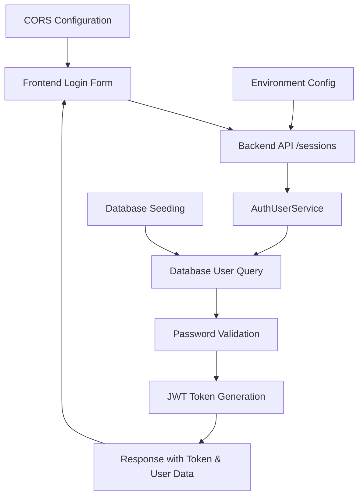

# Login Troubleshooting Design Document

## Overview

This design document outlines a systematic approach to diagnosing and resolving login authentication issues in the WhatsApp ticketing system. The solution focuses on verifying each component of the authentication flow, from database seeding to frontend-backend communication.

## Architecture

The authentication system consists of several interconnected components:

1. **Database Layer**: PostgreSQL database with user seeding and migrations
2. **Backend API**: Express.js server with JWT-based authentication
3. **Frontend Interface**: React application with login form and error handling
4. **Environment Configuration**: Docker/deployment environment settings



## Components and Interfaces

### Database Seeding Component
- **Purpose**: Ensures default admin user exists in the database
- **Interface**: Sequelize migration and seed files
- **Dependencies**: Database connection, bcrypt for password hashing

### Authentication Service
- **Purpose**: Validates user credentials and generates tokens
- **Interface**: `AuthUserService({ email, password })`
- **Dependencies**: User model, JWT helpers, password validation

### Session Controller
- **Purpose**: Handles HTTP requests for login/logout operations
- **Interface**: REST endpoints (`POST /sessions`, `DELETE /sessions`)
- **Dependencies**: AuthUserService, token helpers, socket.io

### Frontend Login Component
- **Purpose**: Provides user interface for credential input
- **Interface**: React form with email/password fields
- **Dependencies**: API service, error handling, routing

## Data Models

### User Model
```typescript
interface User {
  id: number;
  name: string;
  email: string;
  passwordHash: string;
  profile: 'admin' | 'user';
  companyId: number;
  super: boolean;
  online: boolean;
  createdAt: Date;
  updatedAt: Date;
}
```

### Authentication Request/Response
```typescript
interface LoginRequest {
  email: string;
  password: string;
}

interface LoginResponse {
  token: string;
  user: SerializedUser;
}

interface SerializedUser {
  id: number;
  name: string;
  email: string;
  profile: string;
  queues: Queue[];
  companyId: number;
}
```

## Correctness Properties

*A property is a characteristic or behavior that should hold true across all valid executions of a system-essentially, a formal statement about what the system should do. Properties serve as the bridge between human-readable specifications and machine-verifiable correctness guarantees.*

### Property Reflection

After reviewing all properties identified in the prework, several can be consolidated:

- Properties 2.1 and 2.2 both test invalid credential handling and can be combined into one comprehensive property
- Properties 3.1, 3.2, and 3.3 all test successful authentication outcomes and can be combined
- Properties 4.2 and 4.3 both test error handling and can be combined
- Properties 5.3 and 5.4 both test API communication and can be combined

Property 1: Database seeding idempotency
*For any* number of seeding operations, running the seed process multiple times should result in exactly one default admin user
**Validates: Requirements 1.5**

Property 2: Invalid credential security
*For any* invalid email or password combination, the authentication system should return the same "ERR_INVALID_CREDENTIALS" error with 401 status, regardless of whether the user exists
**Validates: Requirements 2.1, 2.2**

Property 3: Login error handling consistency
*For any* login failure scenario, the login interface should display appropriate user-friendly error messages that distinguish between different failure types
**Validates: Requirements 2.3, 2.4**

Property 4: Successful authentication completeness
*For any* valid user credentials, successful authentication should generate a valid JWT token, set refresh token cookie, return complete user data, update online status, and emit socket events
**Validates: Requirements 3.1, 3.2, 3.3, 3.4, 3.5**

Property 5: Database error resilience
*For any* database connection or query failure, the authentication system should handle errors gracefully and use secure defaults when configuration is missing
**Validates: Requirements 4.2, 4.3**

Property 6: API communication reliability
*For any* properly configured frontend-backend setup, the login interface should successfully communicate with the API and handle unreachable endpoints with meaningful error messages
**Validates: Requirements 5.3, 5.5**

## Error Handling

The system implements comprehensive error handling at multiple levels:

### Database Level
- Connection timeout handling with retry logic
- Transaction rollback on seed failures
- Graceful degradation when database is unavailable

### Authentication Level
- Consistent error responses for security (no user enumeration)
- Password validation with bcrypt comparison
- JWT token validation and expiration handling

### API Level
- HTTP status code standardization (401 for auth failures)
- CORS configuration for cross-origin requests
- Request validation and sanitization

### Frontend Level
- Network error detection and user feedback
- Form validation before submission
- Loading states and error message display

## System Assumptions

- bcrypt rounds = 8 (as defined in seed file)
- JWT access token expires in 30 days
- JWT refresh token expires in 7 days
- Database connection timeout = 30 seconds
- API request timeout = 10 seconds
- Maximum login attempts before rate limiting = 5 per minute per IP

## Environment Configuration Requirements

### Required Environment Variables
```bash
# Database Configuration
DB_DIALECT=postgres
DB_HOST=localhost
DB_PORT=5432
DB_USER=whaticket
DB_PASS=whaticket123
DB_NAME=whaticket

# JWT Configuration
JWT_SECRET=kZaOTd+YZpjRUyyuQUpigJaEMk4vcW4YOymKPZX0Ts8=
JWT_REFRESH_SECRET=dBSXqFg9TaNUEDXVp6fhMTRLBysP+j2DSqf7+raxD3A=

# API Configuration
BACKEND_URL=http://localhost:8080
FRONTEND_URL=http://localhost:3000
PORT=8080

# Redis Configuration (for rate limiting)
REDIS_URI=redis://:123456@127.0.0.1:6379
```

## Testing Strategy

### Implementation Order
1. **Property 1** (Database seeding) - Foundation layer
2. **Property 5** (Database resilience) - Error handling foundation  
3. **Property 2 & 4** (Authentication core) - Core business logic
4. **Property 6 & 3** (Frontend integration) - User interface layer

### Unit Testing Approach
**Unit Tests** will cover specific examples and edge cases:
- Database seeding creates exactly one admin user with email "admin@admin.com"
- Authentication with valid credentials "admin@admin.com" / "123456" succeeds
- JWT token structure validation (header.payload.signature format)
- HTTP 401 status code for authentication failures
- Refresh token cookie setting with httpOnly flag

### Property-Based Testing Details

**Library**: fast-check for JavaScript/TypeScript with minimum 100 iterations per test.

**Property 1: Database seeding idempotency**
```typescript
// **Feature: login-troubleshooting, Property 1: Database seeding idempotency**
// Generator: fc.integer({ min: 1, max: 10 }) for number of seeding attempts
// Success Criteria: Exactly 1 admin user exists after N seeding operations
// Test Method: Clear database, run seed N times, count admin users
```

**Property 2: Invalid credential security**
```typescript
// **Feature: login-troubleshooting, Property 2: Invalid credential security**
// Generator: fc.record({
//   email: fc.oneof(fc.emailAddress(), fc.string()),
//   password: fc.string({ minLength: 1, maxLength: 100 })
// }).filter(creds => creds.email !== "admin@admin.com" || creds.password !== "123456")
// Success Criteria: All invalid attempts return "ERR_INVALID_CREDENTIALS" with 401 status
```

**Property 3: Login error handling consistency**
```typescript
// **Feature: login-troubleshooting, Property 3: Login error handling consistency**
// Error Types: network timeout, 500 errors, CORS failures, malformed JSON responses
// Generator: fc.constantFrom("NETWORK_ERROR", "SERVER_ERROR", "CORS_ERROR", "PARSE_ERROR")
// Success Criteria: Each error type displays distinct, user-friendly message
```

**Property 4: Successful authentication completeness**
```typescript
// **Feature: login-troubleshooting, Property 4: Successful authentication completeness**
// Generator: fc.constant({ email: "admin@admin.com", password: "123456" })
// Success Criteria: Response contains valid JWT (3 parts), refresh cookie set, 
//                  user data includes {id, name, email, profile, companyId}, 
//                  online status = true, socket event emitted
// JWT Validation: Decode without verification to check structure, verify signature separately
```

**Property 5: Database error resilience**
```typescript
// **Feature: login-troubleshooting, Property 5: Database error resilience**
// Error Scenarios: connection timeout, query failure, missing tables, invalid credentials
// Generator: fc.constantFrom("CONNECTION_TIMEOUT", "QUERY_ERROR", "TABLE_MISSING", "AUTH_FAILED")
// Success Criteria: Graceful error handling, no crashes, meaningful error messages
// Fallback Testing: Remove JWT_SECRET env var, verify default is used
```

**Property 6: API communication reliability**
```typescript
// **Feature: login-troubleshooting, Property 6: API communication reliability**
// Scenarios: correct URLs, unreachable backend, CORS misconfiguration
// Generator: fc.record({
//   backendUrl: fc.webUrl(),
//   frontendUrl: fc.webUrl(),
//   corsEnabled: fc.boolean()
// })
// Success Criteria: Successful communication when URLs correct, 
//                  meaningful errors when backend unreachable (timeout < 10s)
```

### Integration Testing with Test Containers
- Use Docker containers for isolated database testing
- Spin up temporary PostgreSQL instance for each test suite
- Test actual JWT token generation and validation (no mocking)
- Verify socket.io events using real WebSocket connections
- Test CORS configuration with actual cross-origin requests

### Edge Cases and Security Testing
- **Deleted Admin User**: Test system behavior when default admin is manually deleted
- **Concurrent Logins**: Verify multiple simultaneous login attempts for same user
- **Token Expiration**: Test behavior when JWT expires during active session
- **Rate Limiting**: Implement and test brute force protection (5 attempts/minute/IP)
- **SQL Injection**: Test authentication with malicious SQL in email/password fields

### Success Metrics and Acceptance Criteria

**Property 1**: Pass if exactly 1 admin user exists after 10 consecutive seeding operations
**Property 2**: Pass if 100 random invalid credential combinations all return same error
**Property 3**: Pass if all 4 error types (network, server, CORS, parse) show distinct messages
**Property 4**: Pass if all 6 authentication outcomes occur within 2 seconds
**Property 5**: Pass if system handles all 4 error scenarios without crashing
**Property 6**: Pass if API communication succeeds with valid config and fails gracefully with invalid config

### Manual Testing Checklist
- [ ] Verify default credentials (admin@admin.com / 123456) work in deployed environment
- [ ] Test login with 5+ different invalid credential combinations
- [ ] Validate error messages are user-friendly and don't expose system internals
- [ ] Confirm JWT tokens are properly generated and stored in browser
- [ ] Check database connectivity using admin panel or direct query
- [ ] Verify seeding status by counting users in database
- [ ] Test CORS by accessing frontend from different domain
- [ ] Validate rate limiting by attempting rapid login attempts